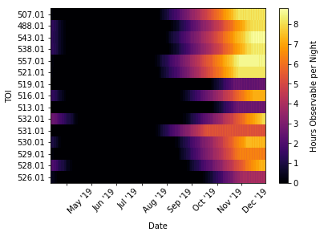

# TESSalerts

This repository contains code to select targets for follow-up observations based on candidates from the TESS alerts platform (https://tev.mit.edu). It can be applied to a list of alerts to evaluate their visibility at a specified site and filter them for various parameters.

A typical use-case would be to answer the question: "_Which of these candidates **are M dwarfs** and **observable from my observatory** and **when** should I target them?_"


Quickstart
----------
1. Run `jupyter notebook TESSalerts.ipynb`
2. Adapt the program parameters to your needs
3. Follow the steps in the notebook

Dependencies
------------
The code was written for Python 3.6 and makes use of the following packages:
  + numpy
  + pandas
  + matplotlib
  + astropy
  + astroplan
  + astroquery
  + jupyter (optional)
  + openpyxl (optional)

Usage
-----
To facilitate readability and maintainability, the pipeline is quite granularized with every step represented in a python function. These functions are equipped with docstrings, live in `observability.py`, and can be called independently. A Jupyter notebook `TESSalerts.ipynb` presents an example pipeline that uses these functions to perform all steps from reading a list of TESS alerts to arriving at a table of suitable targets.

A number of plots are supposed to help with prioritizing those targets, for example:


Troubleshooting
--------------
In case the IERS (International Earth Rotation and Reference Systems) server is inaccessable, you can temporarily disable auto-downloading of recent IERS tables,
```
>>> from astropy.utils import iers
>>> iers.conf.auto_download = False
```
or set the max age parameter to a higher value (or None)
```
>>> iers.conf.auto_max_age = None
```
**Note that this can give you inaccurate time estimates!**
For more info, see https://docs.astropy.org/en/stable/utils/iers.html


------------
The code in this repository was written by Martin Schlecker (schlecker@arizona.edu) with contributions by Paz Bluhm (pbluhm@lsw.uni-heidelberg.de). It is being actively developed in an open repository, so if you have any trouble please raise an [issue](https://github.com/matiscke/TESSalerts/issues/new "New Issue").
